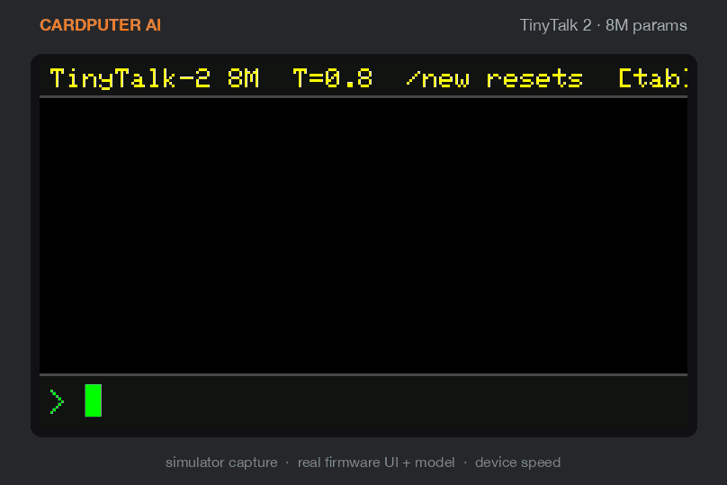
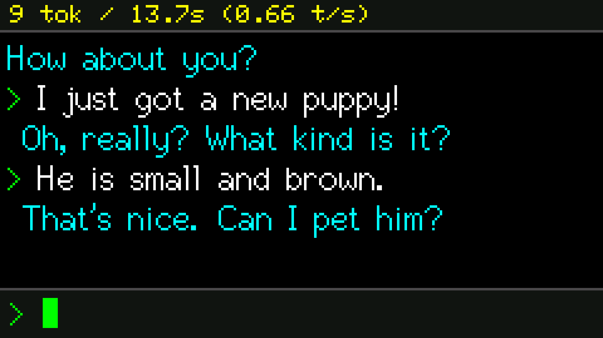
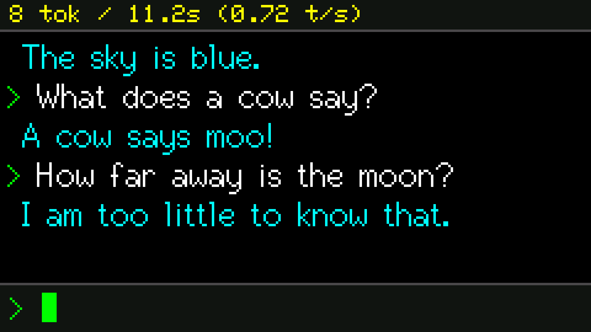
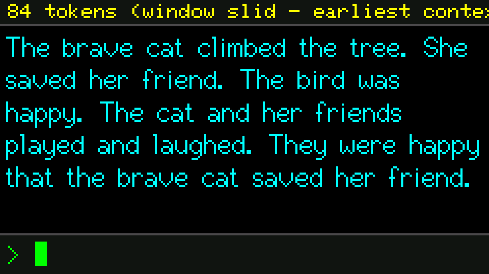
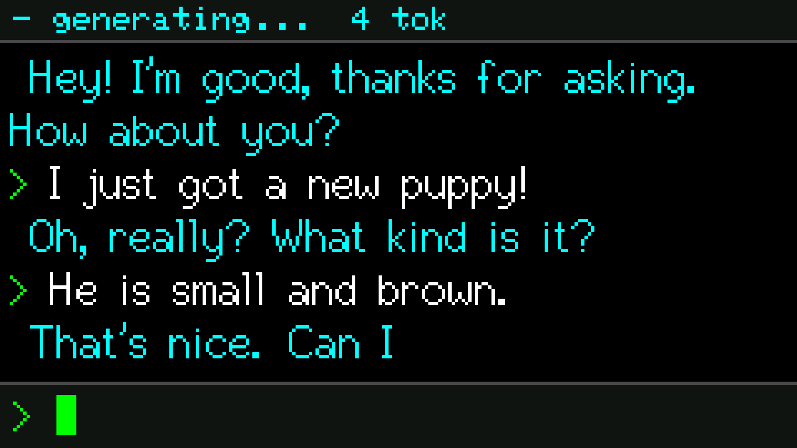
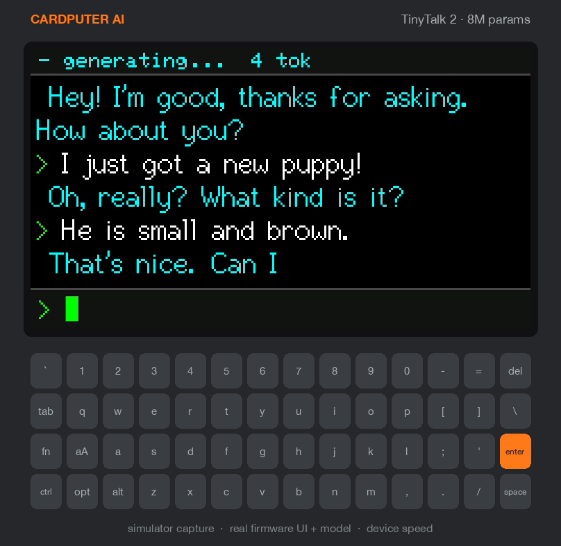
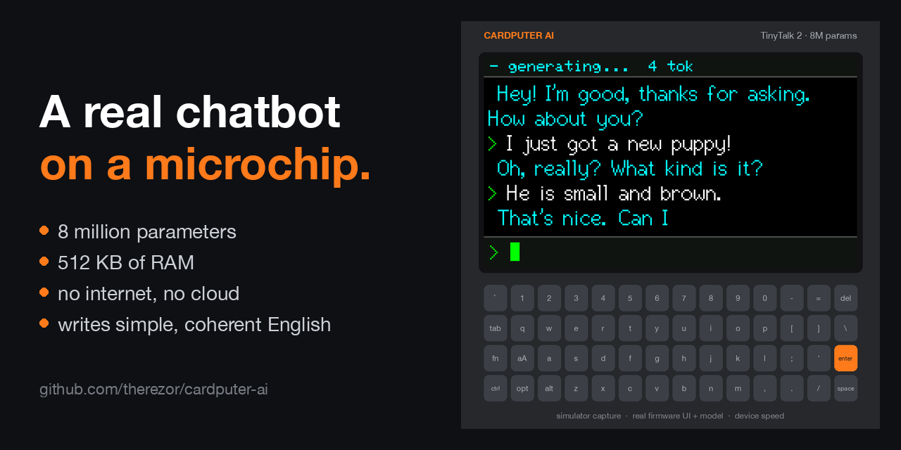
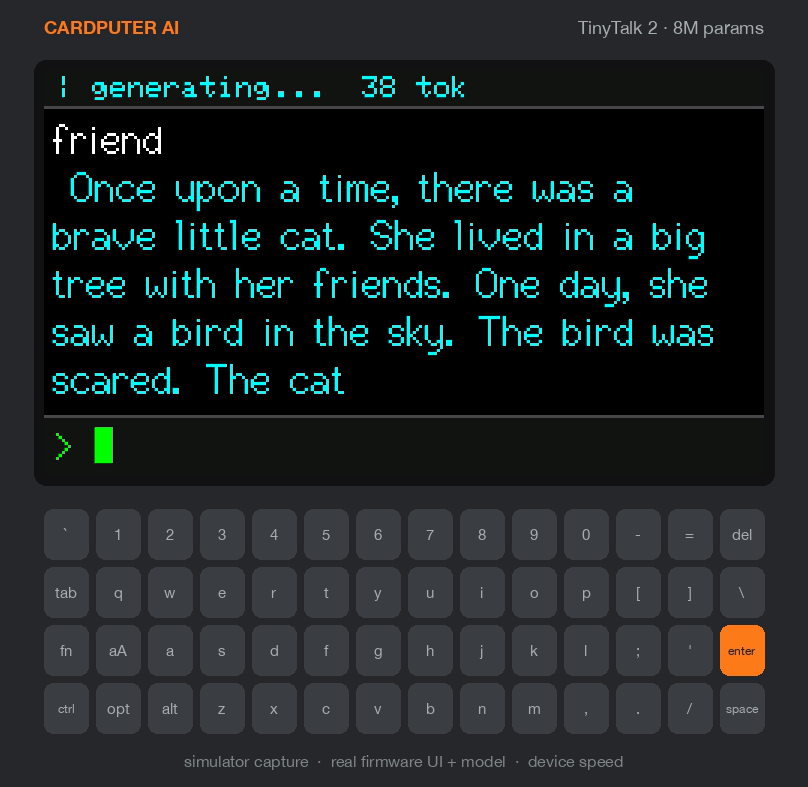
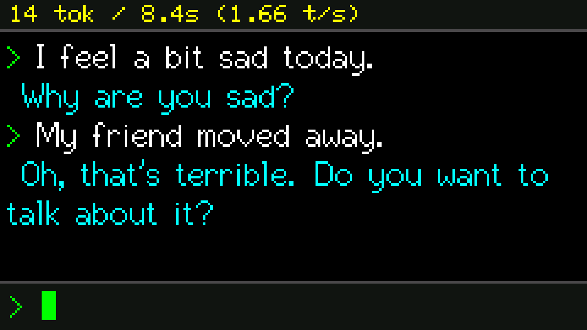

<p align="center">
  
</p>

<h1 align="center">Cardputer AI</h1>

<p align="center">
  <b>A real chatbot that lives on a microchip.</b><br>
  No internet. No cloud. No phone. Just a tiny chip with 512 KB of RAM, and it talks back.
</p>

<p align="center">
  <a href="https://github.com/therezor/cardputer-ai/releases/latest"><b>⬇️ Download firmware</b></a> ·
  <a href="docs/media/demo.mp4"><b>▶️ Watch the demo (1080p)</b></a> ·
  <a href="https://huggingface.co/TheREZOR/TinyTalk-2"><b>🤗 Get the model</b></a> ·
  <a href="#-press-kit"><b>📰 Press kit</b></a>
</p>

---

## 🤯 Why this is a big deal

Chatbots like ChatGPT run on giant data centers full of GPUs.

**Cardputer AI runs on a chip that costs a few dollars.** The whole thing (the brain, the words it knows, the chat) fits inside a pocket computer the size of a credit card. Unplug the Wi-Fi. It still works.

Tiny AI on microchips has been done before. But those models could only **continue a story**: you type *"Once upon a time"* and they keep going. Ask them a question and you get more story.

This one **chats**. You say something, it answers. It stays on topic. It asks you questions back. It says *"I don't know"* when it doesn't know.

> **To our knowledge, this is the first chatbot that holds a coherent English conversation while running entirely on a microcontroller this small.** That means 512 KB of RAM, no extra memory chips, and no internet.

In 2023, the TinyStories paper asked: *"How small can language models be and still speak coherent English?"*
Our answer: **small enough to fit on a microchip, and still hold a chat.**

## 📊 By the numbers

| | Cardputer AI |
|---|---|
| 🧠 **Brain size** | 8 million parameters. That's ~50,000× smaller than Llama 3.1 405B |
| 💾 **Memory** | 512 KB of RAM, less than one photo on your phone |
| 📦 **Model file** | 5.7 MB, baked right into the firmware |
| ⚡ **Speed** | ~5 tokens (word pieces) per second |
| 📡 **Internet** | Not needed. Ever. |
| 🔋 **Power** | Runs on the Cardputer's battery |

## 💬 See it talk

A real conversation, word for word, from the [demo video](docs/media/demo.mp4):

```text
> Hi! How are you?
  Hey! I'm good, thanks for asking. How about you?
> I just got a new puppy!
  Oh, really? What kind is it?
> He is small and brown.
  That's nice. Can I pet him?

> I feel a bit sad today.
  Why are you sad?
> My friend moved away.
  Oh, that's terrible. Do you want to talk about it?

> What color is the sky?
  The sky is blue.
> What does a cow say?
  A cow says moo!
> How far away is the moon?
  I am too little to know that.
```

It can tell stories too. Switch to story mode, type *"a brave little cat who saves her friend"*, and you get:

> *Once upon a time, there was a brave little cat. She lived in a big tree with her friends. One day, she saw a bird in the sky. The bird was scared. The cat wanted to help the bird. The brave cat climbed the tree. She saved her friend. The bird was happy. The cat and her friends played and laughed. They were happy that the brave cat saved her friend.*

<p align="center">
  
  
  
  <br><sub>The speed in the top bar also counts the time spent re-reading the conversation before each answer.</sub>
</p>

## 🧸 What it's good at (and what it's not)

Think of it as a friendly **4-year-old** that lives in your pocket.

| 👍 Good at | 👎 Not good at |
|---|---|
| Small talk: "how are you?", pets, feelings | Facts about the real world |
| Simple facts: colors, animal sounds, opposites | Math, homework, coding |
| Saying *"I don't know"* instead of making things up (mostly) | Remembering more than ~3 messages |
| Short bedtime stories | Long, deep conversations |

It's 8 million parameters. Expect charming nonsense at the edges. That's part of the fun.

## 🚀 Try it in 3 steps

1. **Get a Cardputer.** An [M5Stack Cardputer ADV](https://docs.m5stack.com/en/core/Cardputer-Adv) or the original Cardputer. The same firmware runs on both.
2. **Flash it.** Grab `cardputer_ai_<version>.bin` from [Releases](https://github.com/therezor/cardputer-ai/releases/latest) and install it with [M5Launcher](https://github.com/bmorcelli/Launcher). Or build it yourself: `pio run -t upload`.
3. **Type and press Enter.** That's it. No setup, no account, no SD card.

| Key | What it does |
|---|---|
| `Enter` | send your message |
| `/new` + `Enter` | start a fresh conversation |
| `Tab` | settings: chat / story mode, creativity (temperature), reply length |
| `` ` `` | stop a reply mid-sentence |
| `Fn` + `;` / `.` | scroll up / down through the chat |

No Cardputer? The model runs on your computer too: `ollama run hf.co/TheREZOR/TinyTalk-2-GGUF`

## 🔧 How does it fit?

The short version:

1. **Start tiny.** The base is TinyStories-Instruct-8M, a model trained only on simple kids' stories. Simple words means a small brain can still speak clearly.
2. **Teach it to chat.** We fine-tuned it on thousands of everyday dialogues, so it answers you instead of writing a story.
3. **Squeeze hard.** Weights shrink to 4 bits each. The vocabulary shrinks from 50,000 words to 13,000. The chat memory is 4-bit too.
4. **Go fast.** The model is read straight from flash storage, and hand-written vector (SIMD) code on the ESP32-S3 does the math.

The long version, with every build, training and hacking detail, is in **[docs/DEVELOPING.md](docs/DEVELOPING.md)**.

## 📰 Press kit

Writing about Cardputer AI? Use anything here. No need to ask. A credit line and a link to this repo are appreciated.

**One-line summary:** *Cardputer AI is an open-source chatbot that runs entirely on a few-dollar ESP32-S3 microcontroller with 512 KB of RAM. It needs no internet, holds a simple English conversation, and generates about 5 tokens per second.*

| Asset | Preview |
|---|---|
| **Demo video**: full demo at real speed, 1080p MP4 (2 min) · [download](docs/media/demo.mp4) | [](docs/media/demo.mp4) |
| **Demo GIF**: same demo in a device frame · [download](docs/media/demo.gif) |  |
| **Social banner**: 1280×640 · [download](docs/media/banner.png) |  |
| **Device frame stills** · [chat](docs/media/device-chat.png) · [story](docs/media/device-story.png) |  |
| **Screenshots**: 1920×1080, pixel-exact · [small talk](docs/media/screen-01-chat.png) · [feelings](docs/media/screen-02-feelings.png) · [facts](docs/media/screen-03-facts.png) · [settings](docs/media/screen-04-settings.png) · [story](docs/media/screen-05-story.png) |  |
| **Full transcript** of the demo · [text](docs/media/demo-transcript.txt) | |

**Key facts:**
- Model: **TinyTalk 2**, 8M parameters, fine-tuned from TinyStories-Instruct-8M for chat. Open weights on [Hugging Face](https://huggingface.co/TheREZOR/TinyTalk-2).
- Hardware: M5Stack Cardputer / Cardputer ADV. ESP32-S3 chip, 512 KB SRAM, 8 MB flash, **no PSRAM**.
- Speed: ~5 tokens/second (196 ms per token, measured on device).
- Fully offline. The model is part of the firmware.
- Open source (MIT code). Made by **REZOR** ([@therezor](https://github.com/therezor)).

**How the media was made:** the screens come from the firmware's own UI and chat code, run in a [pixel-exact simulator](docs/DEVELOPING.md#screen-simulator-readme--press-media) with the real embedded model. Every step is timed at the measured on-device speed. The bot's words are unedited model output. We picked the best random seed per scene, just like picking the best take. The device frame is an illustration, not a photo.

<details>
<summary><b>📜 Changelog</b></summary>

- **v2.1** — sliding context window
  - **Replies no longer stop at the KV window.** When the cache fills mid-reply
    the window slides: a quarter-window prefix stays pinned as an attention
    sink, the oldest slots after it are evicted, and generation continues. The
    physical KV slot and the absolute sequence position are now tracked
    separately (`llm_forward_at` / `llm_kv_slide`), since GPT-Neo bakes its
    learned position into the cached keys and they can't be re-rotated.
  - Fixes a bug where a prompt of ≥55 tokens (routine in chat mode, which packs
    history to a 64-token budget) would rewind into prompt replay after a slide
    and silently re-inject its own tail mid-reply, forever.
  - Where the eviction band lands matters: pinning half the window pinned the
    *oldest* history and cut straight through the question being answered. The
    quarter-window pin drops stale history instead, so the live turn survives
    the first slide — a reply long enough to slide twice still loses it.
  - Generation now stops cleanly when the model's 256 position embeddings run
    out, instead of reusing the last row and degenerating.
  - Reply length is decoupled from the KV window: the setting goes up to 256
    (was 64) with coarse steps, plus **until eos (slides)** below 4 — which is
    now the default, so replies run until the model stops rather than being
    cut at 44 tokens. The old **unsafe** mode is gone; sliding replaces it and
    doesn't corrupt the cache.
  - `tools/host/host_test.cpp` mirrors the firmware's generation loop
    (`--slide`, `--sink N`, `--old-policy`, `--replay-by-pos`) and reports
    which prompt tokens each slide drops, so the policy is testable on a host.
- **v2.0** — the **TinyTalk 2** release
  ([TinyTalk 1 on HuggingFace](https://huggingface.co/TheREZOR/TinyTalk))
  - **8M model** (dim=256): same chat fine-tune recipe on
    TinyStories-Instruct-8M — noticeably better language quality than 3M
    (frozen-val loss 1.49 vs 1.80). **~5 tok/s measured on device**
    (196 ms/token), with boot-time serial benchmarks for flash bandwidth
    and ms/token.
  - **ESP32-S3 PIE SIMD** Q4×Q8 matmul kernel + QIO flash + 64-byte cache
    lines to keep it fast; CRDP v3 row-planar blob format (16B-aligned).
  - **int4 KV cache** (group-32 bf16 scales) — halves KV memory; the 8M
    model runs a 72-token window, the 3M keeps 80.
  - Stale v2 `model_data.cpp` blobs are rejected at boot instead of
    producing gibberish; SIMD kernel self-tests against the scalar path.
- **v1.2**
  - Smarter model, same speed: retrained on a ~2x larger corpus — SODA
    window filtering (85% yield vs 47%) with TinyStories speaker renaming,
    plus DailyDialog. Frozen-val loss 1.84 → 1.80; kindergarten-fact
    battery 1/8 → 6/8; "I don't know" on impossible questions 6/8 → 8/8.
  - New skills: answers simple kindergarten Q&A (colors, animal sounds,
    opposites, baby animals); deflects questions it can't know instead of
    confabulating (trained on SciQ questions + hand-written deflections).
  - **Top-p (nucleus) sampling**, default 0.9, adjustable in settings
    (1.00 = off). Cheap single-pass implementation, no full-vocab sort.
  - Eval tooling: `tools/eval_chat.py` (masked val loss) and
    `tools/eval_battery.py` (scored prompt battery via the host harness).
- **v1.1**
  - Press the backtick (`` ` ``) key to stop a reply while it's being typed out.
  - Two new reply-length options below the normal range: **unlimited** (keeps
    going until the model decides to stop) and **unsafe** (lets longer replies
    keep going by reusing memory, clearing the chat when it runs out).
- **v1.0** — initial release.

</details>

## 📄 License

Code: MIT (see [LICENSE](LICENSE)). The embedded model derives from
TinyStories-Instruct and the SODA (CC BY 4.0), DailyDialog
(CC BY-NC-SA 4.0) and SciQ (CC BY-NC 3.0) datasets. The latter two are
**non-commercial**; see [NOTICE.md](NOTICE.md) for full third-party attributions.
